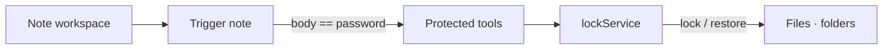

# Note

> A local file-locking tool disguised as a memo app

[한국어](README.md) · [MIT License](LICENSE) · Node.js 24+ · Electron · 

On the surface it's an ordinary memo app. But with one trigger note only the owner
knows, it opens protected tools for locking and restoring selected files and folders.
The tools hide behind an ordinary-looking note, so they don't stand out even when the
app is open.

**Designed to stop casual local access — not advanced attackers, malware, or forensic analysis.**

## Architecture



## Quick start

```bash
node -v      # Node 24+
npm install
npm run dev
```

## Features (current MVP)

| Feature | Description |
|---------|-------------|
| Note workspace | Shows a normal note workspace |
| First-run password | Sets a password once on first launch |
| Concealment | Hides the protected tools behind one ordinary-looking note |
| Locking | Locks a file or folder from the protected note area |
| Restore | Restores the locked item to its original path on unlock |
| Packaging | Produces a Windows zip bundle containing the runnable app |

## Security boundary

This MVP is designed to stop casual local access, not advanced attackers, malware, or
forensic analysis.

- **The password is stored plainly in local app state for simplicity in this version.**
- The trigger note unlocks the protected tools when its saved body matches the password.
- Locked items are restored to their original path on unlock.
- Packaged builds keep their `userdata` folder beside the extracted app executable.

## Build

Build the Windows zip bundle:

```bash
npm run dist:win
```

Output: `release/Note-Windows-0.1.0.zip` (artifactName `${productName}-Windows-${version}.${ext}`)

The GitHub Actions workflow `.github/workflows/windows-build.yml` runs on
`windows-latest`, installs dependencies, runs lint and tests, then builds the zip
bundle and uploads it as an artifact named `Note-Windows-Zip`.

## Development

```bash
npm run lint
npm run build
npm run test    # vitest
```

The workflow and local baseline target Node 24. appId is `com.secretfolder.note`,
current version `0.1.0`.

## License

[MIT](LICENSE) © 2026 AhnRyu
